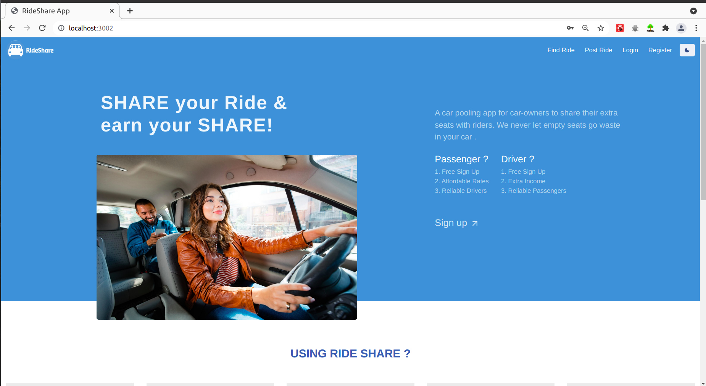
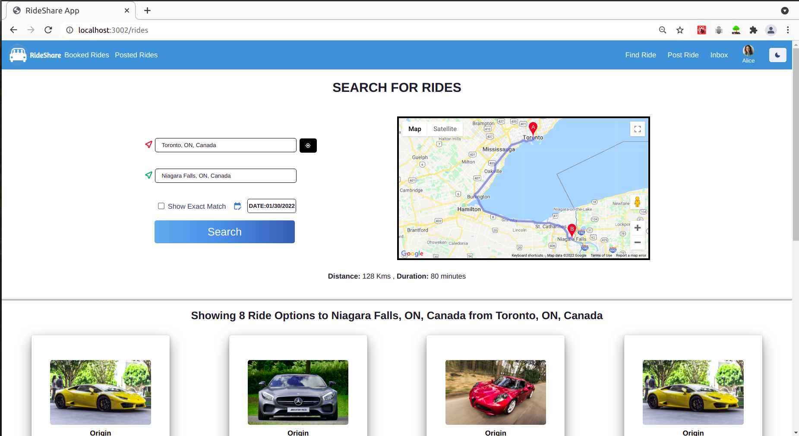
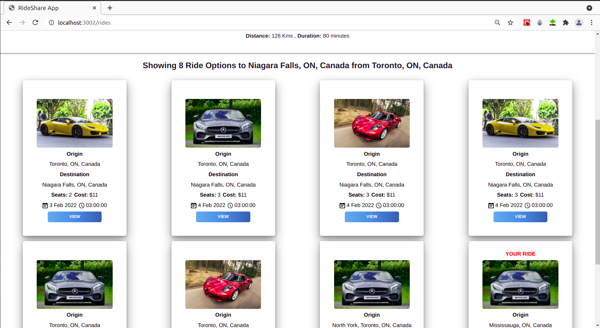
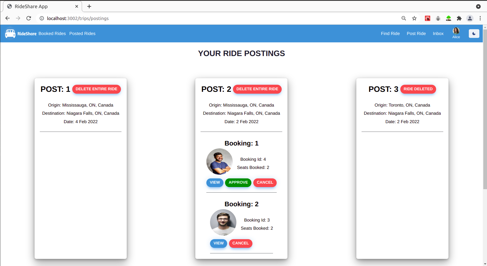
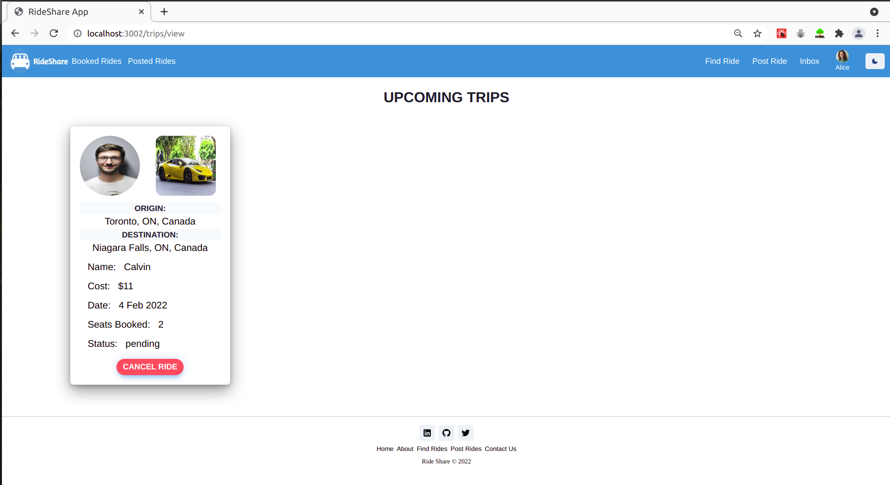
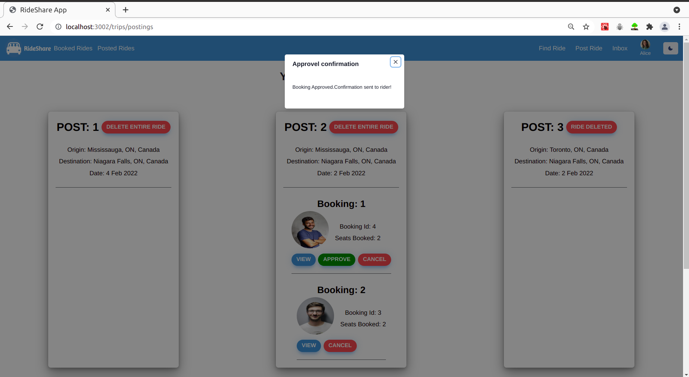
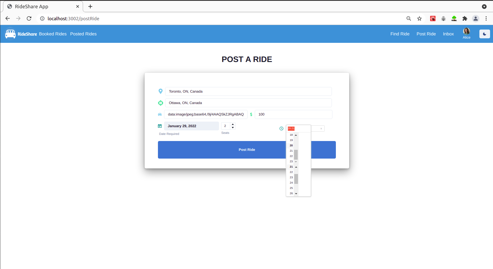
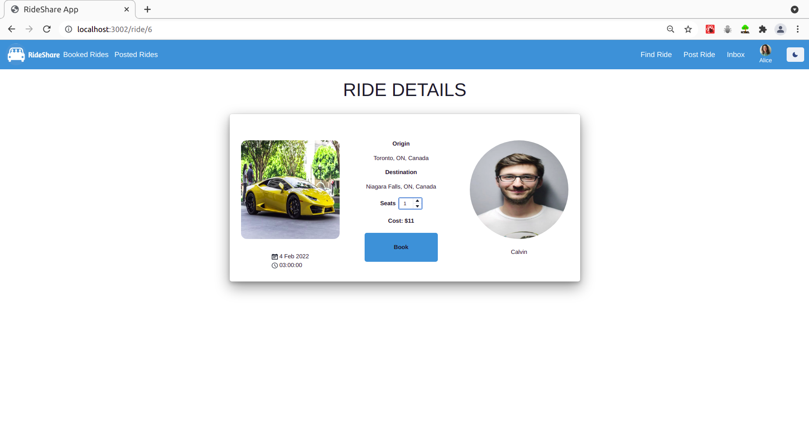
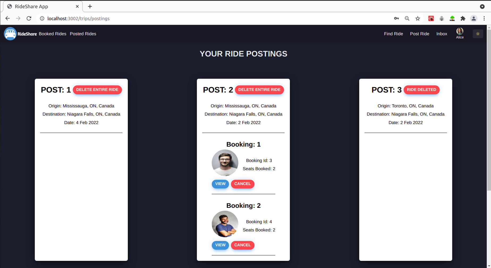
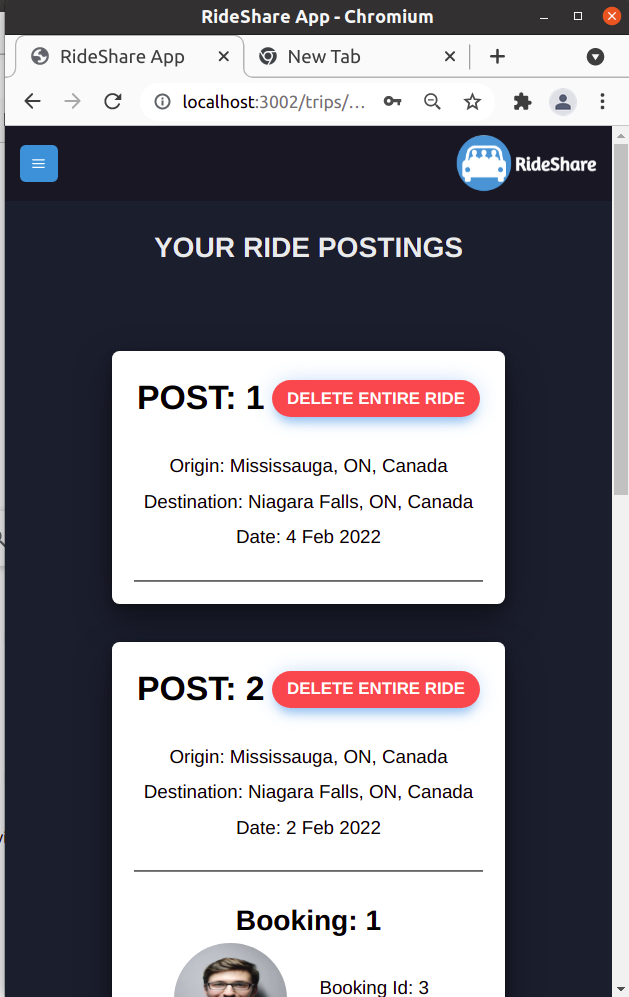

# RideShare
## A Peer-to-Peer Car pooling Application.

### RideShare application helps fill your vacant seats in your car, help find co-riders, and make money on the go.

<hr>

### This project is build in collaboration with  <a href="https://github.com/kaviramsv">Kavita Ramesh</a>

<hr>

## Tech Stack we used:
* ReactJS
* NodeJS/ExpressJS
* PostgreSQL
* Chakra UI
* Redis

<hr>

## Project Screenshots

 
 
 
 

### Dark mode and mobile responsive on all pages

 

## Setup
### To get a local copy of RideShare and running, follow these steps:

Clone the repo

``` 
git clone <https://github.com/MajorChe/RideShareApp.git> <pathname> 
```

Install dependencies for both React and Express from inside their respective directories

``` 
npm install 
```

Setup PostgreSQL Database


``` 
psql -U <username> <password>
CREATE DATABASE rideshare 
```

Configure a env file to connect a database to the backend - an example is provided as .env.example

``` 
DB_HOST=  LOCALHOST
DB_PORT=  DATABASE_PORT
DB_USER=  DATABASE_USERNAME
DB_PASS=  DATABASE_PASSWORD
DB_NAME=  DATABASE_NAME 
```

Seed the Database in the Express backend

``` 
npm run db:reset
```

Run Express backend server Locally!

``` 
npm start
```

Run React front end Locally!

``` 
npm start 
```


## Install all npm dependencies 
Please go inside client and server folders and do:

```
npm install
```

## Feel free to Chat 
* charit.sharma@outlook.com


